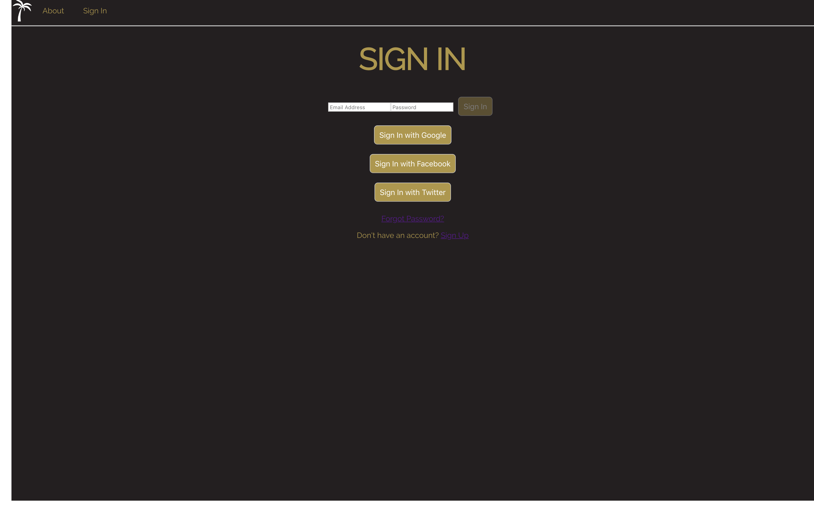

# Eventspo!

> Running Live at https://eventspo.firebaseapp.com

> Recorded Presentation of Project @ Holberton School.  ** Includes a Dev Rel oriented talk on Learning React in 7 days **
- https://www.youtube.com/watch?v=80aLkLUTvDE&list=PLlLHfkTcnvmN7UttKtSjc31vmF82tsJWd&index=4&t=0s

## What is it?

Eventspo was created as a personal challenge to myself to learn new technologies I have not interacted with before and implement them into a usable Full-Stack Implementable Web App Setup.  A boilerplate for myself if you will, for developing a web app for a new company in a short amount of time! 

In addition to this boilerplate I utilized this project to present about a Technology used to work on skills necessary to enter the world of Developer Relations.  I spoke about how to learn React in 7 days and utilize it to build a working web app like the one presented here.  

---

## Features

Eventspo is built entirely with React, styled with CSS in JS/Styled Components only, utilizing Firebase to handle User Authentication and Database functionality.

###Built with:
- [x] Boostrapped with Create React App to build Webpack
- [x] React 16.8.4
- [x] Firebase 5.9
- [x] React-Router 4.4
- [x] React-Parralax 2.2
- [x] Styled-Components 4.1.3

###Implemented Functional Features:
- [x] Sign In
- [x] Sign Up
- [x] Sign Out
- [x] Password Management (Replace existing, Forgotten Password Handling)
- [x] User Verification via Email
- [x] Route Protection via Authorization
- [x] Roles Assigned to Users or Admin via Authorization
- [x] OAuth Logins via Google, Facebook, and Twitter
- [x] An Account Dashboard where Users can Link their Social Accounts
- [x] Authorization Persistence via Local Storage
- [x] Database with Known Users
- [x] Privacy Policy Implementation

###Styling Features:
- [x] All styling achieved with Styled Components
- [x] Parallax effect for About Page scrolling info

###Roadmap for Development:
- [ ] Insert Content to empty Components
- [ ] Create many to many relationships between Vendors, Venues, and Users
- [ ] Expand Roles to Client, Provider, and Planner
- [ ] Implement Floating Card System for Vendors, Venues, Events, etc.
- [ ] Be able to save lists of Providers and export them
- [ ] Introduce a Calendaring/Event Creation system
- [ ] Message board or Chat functionality 

---

## Give it a try:

- Clone or download this repository:
  - `git clone https://github.com/jsjimenez51/Eventspo-v1.git`
- run `npm install` to install dependencies
- run `npm start` to open on browser with localhost
- if browser does not open visit: http://localhost:3000/ to see local rendering
- MUST USE your own Firebase Credentials!!!

### How to get your own Firebase Credentials:
- visit https://firebase.google.com and create a Firebase App
- copy and paste your Credentials from your Firebase App into *src/components/Firebase/firebase.js* file or in .env file
- activate Email/Password, Google, Facebook and Twitter Sign-In Methods for your Firebase App

---

## ScreenShots

---

## Author
* Joshua Jimenez, [jsjimenez51](https://github.com/jsjimenez51) | [@bigjoshcodes](https://twitter.com/bigjoshcodes)
